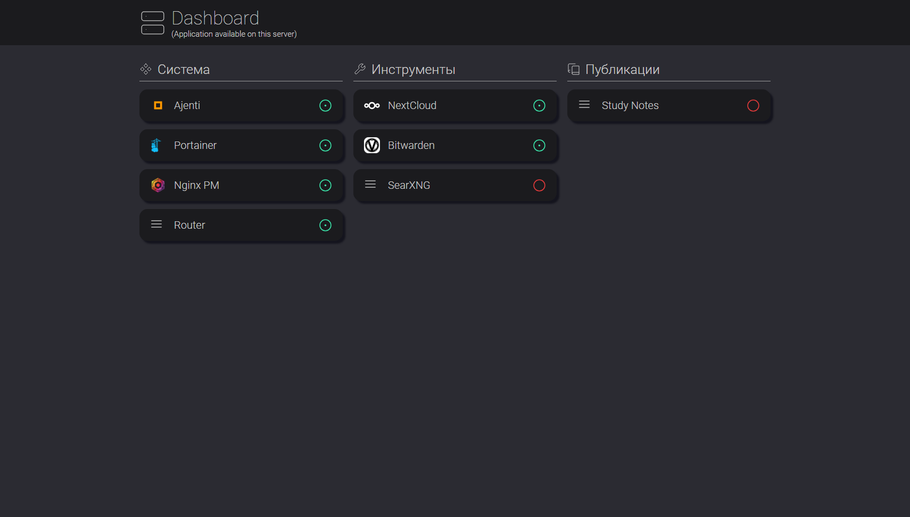
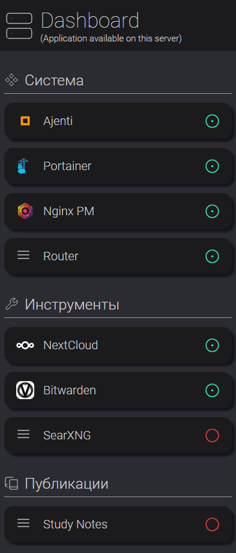

# Homeserver dashbord 

> Simple dashbord for your homeserver

| decktop                       | mobile                 |
| :---------------------------: | :--------------------: |
|          |  |

# Set-up

1. Install [docker](https://docs.docker.com/engine/install/)
2. Somewhere on your server create `services.json` with your server settings

- Group
    - `title` text in header of services group
    - `icon` id of [licide icon](https://lucide.dev/icons/) for group header
    - `services` list of services in this group
- Service
    - `title` text in card
    - `url` path to service (like `https://example.com`)
    - `logo_path` path to service icon (find it using DevTools in browser or RBM -> Copy link to image). If you want use llcide icon leave this field empty ("")
    - `icon` (_optional_) id of [licide icon](https://lucide.dev/icons/) for service card. Using if `logo_path` is empty, incorrect or unavailable

Structure of `services.json`

```
[
    {
        "title": "Group 1 title",
        "icon": "lucide-icon-for-groupe",
        "services": [
            {
                "title": "Service 1 title",
                "url": "service-1.com",
                "logo_path": "service-1.com/icon.png" // or "" for using icon
                "icon": "lucide-icon-for-service" // optional
            },
            {
                "title": "Service 2 title",
                ...
            }
        ]
    },
    {
        "title": "Group 2 title",
        ...
    }
]
```

3. Start docker container 
```bash
export PORT = 80
export PATH_TO_SERVICES_JSON = "abs/path/to/services.json"
docker pull apicomplexa/dashboard
docker run -d -v $PATH_TO_SERVICES_JSON:/app/services.json -p $PORT:80 --name="dashboard" apicomplexa/dashboard
```
5. Dashboard available in `http://localhost:$PORT` (80 by default)
6. Changing in `services.json` don't require restarting of container, just page reload (and cleaning cache sometimes)
7. You can use reverse proxy to get SSl certivicate and use HTTPS


# Credits 

- Cors-anywhere nginx config by [eolme](https://github.com/eolme) ([habr post](https://habr.com/ru/articles/651253/))
- lucide icons
- create react app


# Developing

1. Clone this repo
2. Create `services.json` in `/public/` directory
3. `npm start`

> In that moment in dev mode service running requests are always positive. Couse now in dev mode simple `react-scripts start` is used for hot-reload and other tips, but not custom nginx server for processing requests to services. I'm going to change that someday.